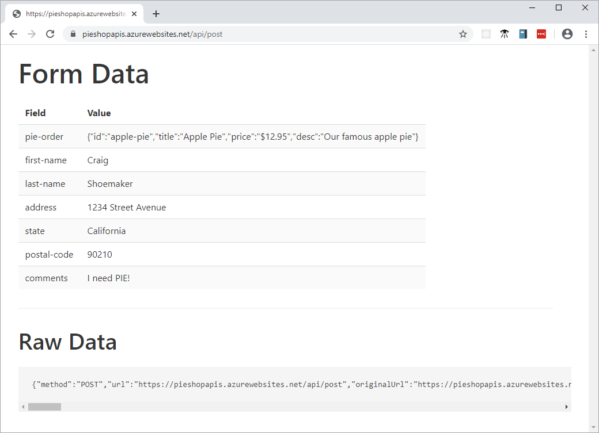

# Echo Post

This is a very simple Azure Functions app that displays the contents of an HTTP POST back to the user.

## Get started

- Install [Node.js](https://nodejs.org/download/)
- Install the [Azure Functions extension for VS Code](https://marketplace.visualstudio.com/items?itemName=ms-azuretools.vscode-azurefunctions)

Start a debugging session to run the application. Post requests to `http://localhost:7071/api/post`.
